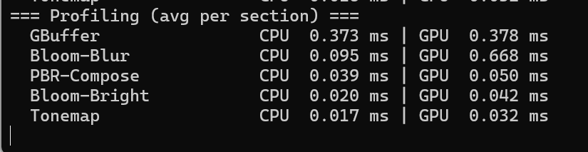
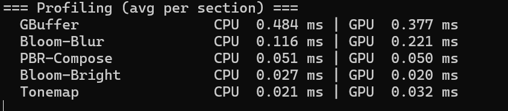
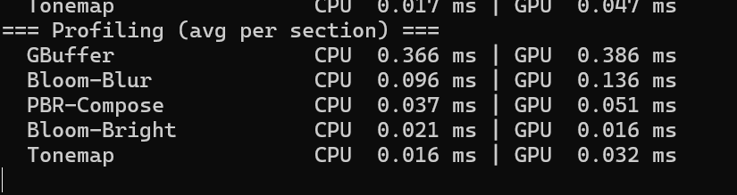

# Task8 README & 性能报告

提交日期：2025-09-21  

---

## 一、任务回顾
在 Task7 的基础上，本分支完成了延迟渲染 + PBR + IBL + Bloom + Tonemap 的完整管线，同时保留旧资源/调试视图的兼容性。

### 流水线概览
### 1. G-Buffer（几何阶段）
- gPosition（RGB16F 
- gNormalRough（RGB: 线性法线，A: 粗糙度）  
- gAlbedo（RGBA8 / SRGB8_A8
- gMetalAO（R: metallic，G: AO）
- gEmissive（RGB16F，可选

### 2. PBR 合成（HDR）
- Diffuse IBL：Irradiance Map 
- Specular IBL：Prefilter Map + BRDF LUT
- UBO 点光源（与旧管线共存）

### 3. Bloom
- 亮部提取  
- 降采样到 1/2、1/4、1/8 分辨率后分离卷积模糊（H/V ping-pong）    
- 回写到 HDR

### 4. Tonemap
- Reinhard / ACES（可切换） 
- 可选 Gamma 校正（到 sRGB） 

---

## 二、运行与操作

- 编译/运行：与 Task7 一致，无额外依赖。

- 默认视角：启动相机自动对准最左侧发光方块；初始不捕获鼠标。

- F1：切换是否捕获鼠标（开启后可用鼠标旋转）。

- W / A / S / D：移动；Space / Ctrl：上/下。

- 1 / 2 / 3 / 4：切换发光方块强度（0 / 3 / 6 / 10）以观察 Bloom。

- 5：天空盒预览（关 / Env / Irr）。

- 6：调试直出 Albedo（验证 G-Buffer 贴图）。

---

## 三、关键实现要点

### G-Buffer 清理
最少清 color0 (gPosition) 与 depth；其他附件通常由几何写满即可，避免多余带宽。

### 天空盒绘制顺序
先将 GBuffer 的深度 blit 到默认 FBO → 用 LEQUAL 画天空盒（只填背景空像素）→ 进行 PBR 合成。

### Bloom 合成顺序
先在 HDR 中叠加 Bloom，再 Tonemap。否则 LDR 夹紧会损失高光能量。

### Tonemap/Gamma 一致性
全部光照计算在线性空间完成；Tonemap 后只做一次 Gamma（到 sRGB）。避免“发灰感”。

### Profiler
每段包裹 PROFILE_CPU_GPU("Section")，帧末输出 CPU/GPU 平均时序，便于对比不同 downsample 的开销。

---

## 四、性能报告

| Downsample     | 段落             |   CPU |         GPU |
| -------------- | -------------- | ----: | ----------: |
| **1**（1× 分辨率）  | GBuffer        | 0.373 |       0.378 |
|                | Bloom-Bright   | 0.020 |   **0.042** |
|                | **Bloom-Blur** | 0.095 |   **0.668** |
|                | PBR-Compose    | 0.039 |       0.050 |
|                | Tonemap        | 0.017 |       0.032 |
|                | **合计 GPU**     |       | **≈ 1.170** |
| **2**（1/4 分辨率） | GBuffer        | 0.484 |       0.377 |
|                | Bloom-Bright   | 0.027 |   **0.020** |
|                | **Bloom-Blur** | 0.116 |   **0.221** |
|                | PBR-Compose    | 0.051 |       0.050 |
|                | Tonemap        | 0.021 |       0.032 |
|                | **合计 GPU**     |       | **≈ 0.700** |
| **3**（1/8 分辨率） | GBuffer        | 0.366 |       0.386 |
|                | Bloom-Bright   | 0.021 |   **0.016** |
|                | **Bloom-Blur** | 0.096 |   **0.136** |
|                | PBR-Compose    | 0.037 |       0.051 |
|                | Tonemap        | 0.016 |       0.032 |
|                | **合计 GPU**     |       | **≈ 0.621** |

### 结论

- Bloom-Blur 是主要瓶颈：

	- ds=1 → 0.668 ms（最昂贵）

	- ds=2 → 0.221 ms（≈ 3× 加速）

	- ds=3 → 0.136 ms（相对 ds=2 再 ≈1.6×）

- 其他段落（GBuffer / PBR / Tonemap）对降采样不敏感，稳定在 ~0.38 / ~0.05 / ~0.03 ms。

- 推荐默认 downsample = 2（1/4 分辨率）：综合画质与性能的最优点；若追求更省可切 3。

---

## 五、质量与稳定性检查

- 画面偏灰/发雾：确认 Tonemap 后只进行一次 Gamma；PBR 采样全部在线性空间。

- 天空盒闪黑/消失：检查顺序是否为 blitDepth → skybox(LEQUAL) → compose(HDR) → bloom → tonemap。

- Bloom 过强/过弱：调整 threshold/knee/strength/iterations；阈值建议以线性亮度标注，并与曝光联动。

- 极暗镜头优化：亮部提取后读取最小 mip（1×1）亮度，低于阈值就跳过模糊，Bloom 几乎 0 成本。

---
